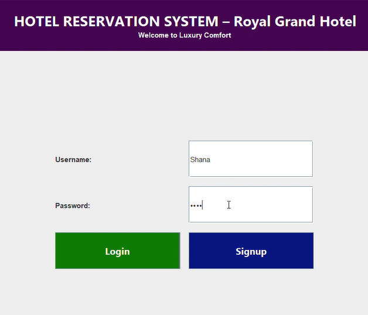
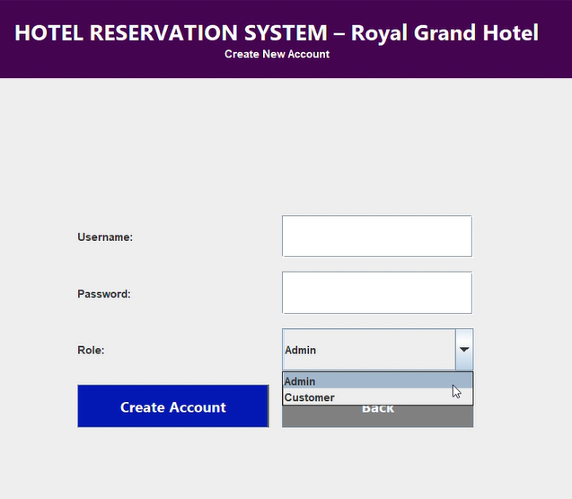
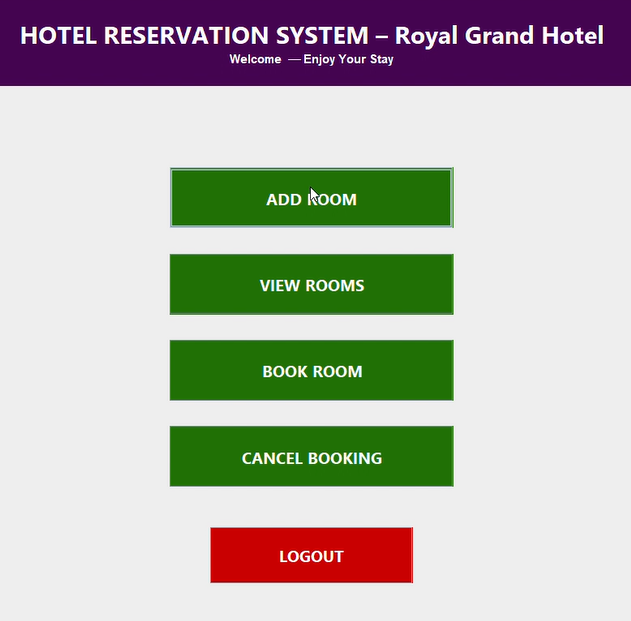
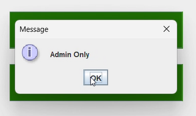
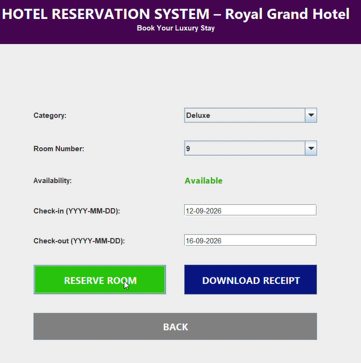
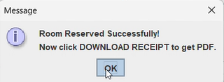
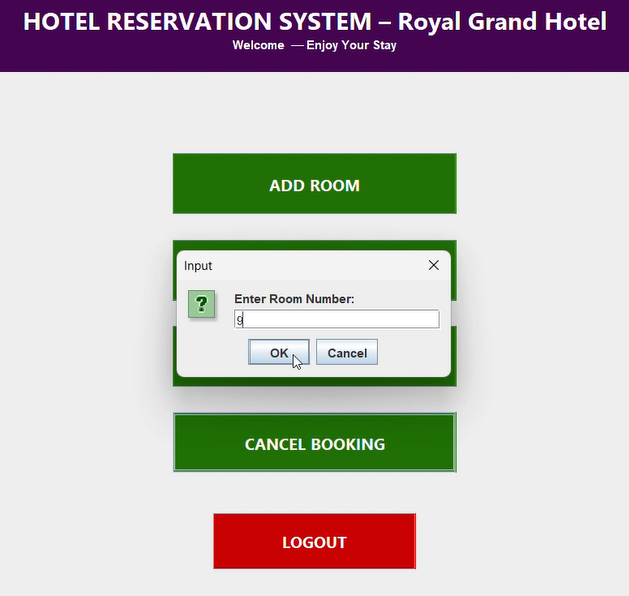
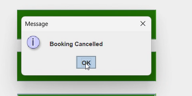
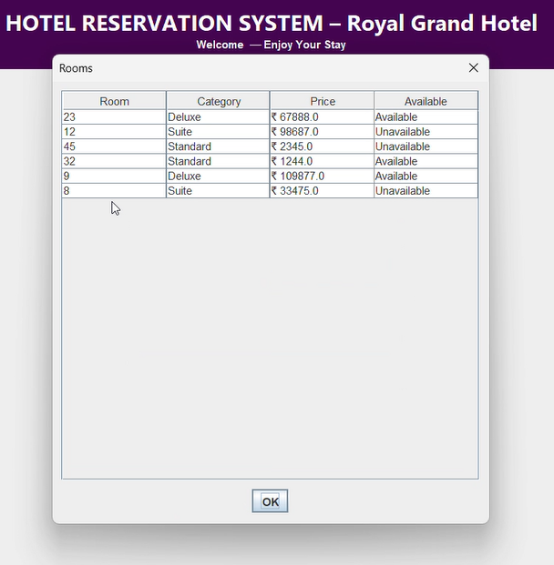

# 🏨 HOTEL RESERVATION SYSTEM – Royal Grand Hotel

A complete **Java Desktop-based Hotel Reservation Management System** built using **Java Swing, SQLite (JDBC), and iText PDF**.

This system simulates a real-world hotel software solution with Admin and Customer roles, booking management, cancellation, and professional PDF receipt generation.

---

## 📌 Project Overview

The **Hotel Reservation System** is a role-based desktop application that allows:

- Admins to manage hotel rooms
- Customers to book and cancel rooms
- Automatic availability tracking
- Downloadable booking receipts in PDF format

This project demonstrates practical implementation of:

- Database connectivity (JDBC + SQLite)
- Role-based authentication
- GUI design using Swing
- File handling and PDF generation

---

## ✨ Features

### 🔐 Authentication System
- User Signup
- Role Selection (Admin / Customer)
- Secure Login
- Role-based access control

---

### 🛎 Admin Functionalities
- Add Room
- Set Room Category (Standard / Deluxe / Suite)
- Set Room Price
- View All Rooms
- Availability Tracking

---

### 🧑‍💼 Customer Functionalities
- Select Room Category
- Dynamic Room Number Loading
- Real-time Availability Status (Available / Unavailable)
- Reserve Room
- Cancel Booking
- Download Booking Receipt (PDF)

---

### 📄 PDF Receipt Includes
- Hotel Name
- Customer Name
- Room Number
- Room Category
- Check-in Date
- Check-out Date
- Amount Paid
- Booking Date

Receipt is saved automatically in:
```
Downloads Folder
```

---

## 🛠 Technologies Used

| Technology | Purpose |
|------------|----------|
| Java Swing | GUI Development |
| SQLite | Database |
| JDBC | Database Connectivity |
| iText PDF | PDF Receipt Generation |
| IntelliJ IDEA | Development IDE |

---

## 🔐 Login Page




## 📝 Signup & Role Selection




## 🏠 Dashboard




## ➕ Admin Adding Room





## 🛏 Book Room Page




## ✅ Reservation Success




## ❌ Cancel Booking





## 📄 Downloaded Receipt


## 📋 View Rooms




---

# 🎯 Project Highlights

✔ Real-time Room Availability  
✔ Role-Based Access Control  
✔ Structured Database Design  
✔ Clean GUI Layout  
✔ Professional PDF Generation  
✔ Internship-Level Production Style  

---

# 🔮 Future Enhancements

- Payment Gateway Integration
- Calendar Date Picker
- Booking History Page
- Admin Analytics Dashboard
- Email Receipt System
- Room Images Upload
- Reports & Revenue Tracking

---

# 💼 Internship Project

This project was developed as part of:

**Java Programming Internship**

It demonstrates:

- Practical Software Development
- Database Integration
- Object-Oriented Programming
- GUI Design Principles
- Business Logic Implementation

---

# 👩‍💻 Author

**Ragavi A**  
Java Programming Intern  

